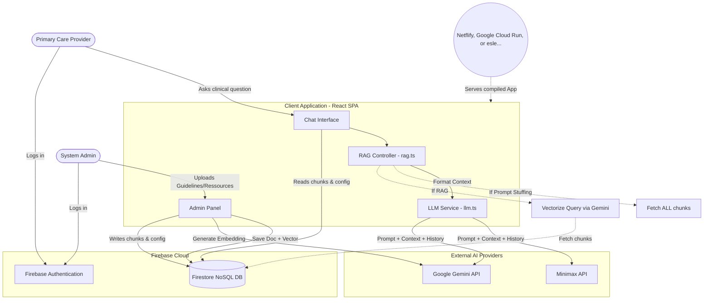
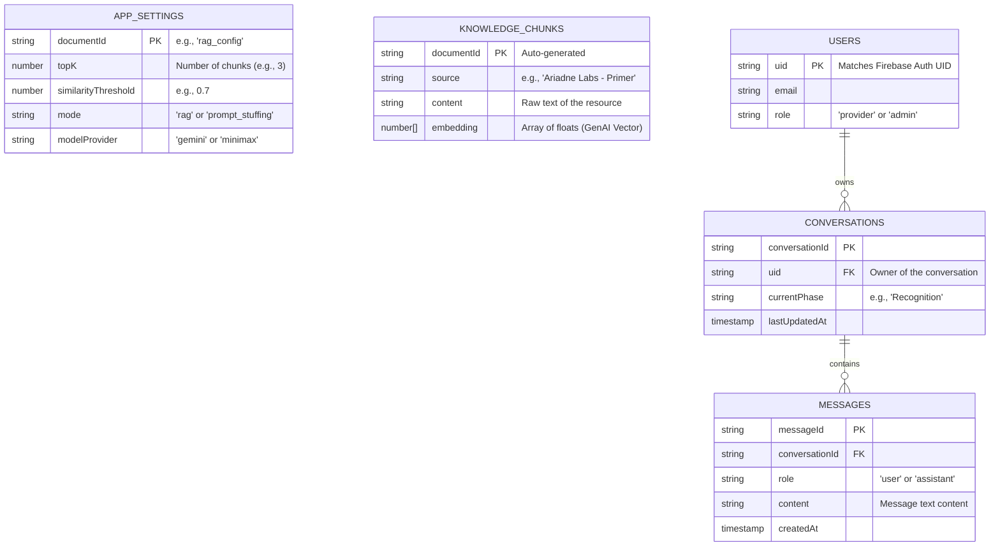

# Dementia Clinical Coach

A clinical decision support web application designed for primary care providers. This tool assists them in the recognition, evaluation, and diagnosis of dementia by leveraging evidence-based medical resources.

## 🌟 Features

- **Specialized AI Coach:** A chatbot powered by the Google Gemini API, configured to provide relevant clinical guidance.
- **Integrated Knowledge Base (RAG):** The assistant uses Retrieval-Augmented Generation (RAG) to ground its responses in the Ariadne Labs "Essential Communications Toolkit".
- **Consultation Management:** Conversation history is saved and organized by session via Firebase.
- **Navigation Map:** An interface guiding the practitioner through 3 key phases: Recognition, Evaluation, and Diagnosis.
- **Admin Panel:** A dedicated interface to inject and manage documentary resources (Knowledge Chunks) and configure RAG parameters.
- **Auto-Seeding:** Automatic injection of default medical resources upon the administrator's first login.
- **Secure Authentication:** Google Sign-In (Firebase Auth) to restrict access.
- **Responsive Design:** Interface optimized for desktop, tablet, and mobile use.

## 🛠️ Tech Stack

- **Frontend:** React 18, TypeScript, Vite
- **Styling:** Tailwind CSS, Lucide React (icons)
- **Backend & Database:** Firebase (Authentication, Firestore)
- **Artificial Intelligence:** Google Gemini API (`@google/genai`) for text generation and embeddings.

## 🚀 Installation and Setup

### Prerequisites
- Node.js
- A Firebase project with Authentication (Google) and Firestore enabled.
- A Google Gemini API key.

### Steps

1. **Install dependencies:**
   ```bash
   npm install
   ```

2. **Configuration:**
   The application requires a `firebase-applet-config.json` file at the root for Firebase configuration, as well as a `GEMINI_API_KEY` environment variable for the AI.

3. **Start the development server:**
   ```bash
   npm run dev
   ```
   The application will be accessible on port 3000.

## 📚 Knowledge Base (RAG)

The application is pre-configured with Ariadne Labs resources:
- **Primer:** Introductory guide to essential communication.
- **Stuck Points Framework:** Framework for managing emotional and relational roadblocks.
- **Sample Language:** Dialogue examples for the recognition, evaluation, and diagnosis phases.

## 🏗️ System Architecture



## 🗄️ Database Schema




## 🤝 In Collaboration With

This project is done in collaboration with the following schools and labs:

| EPFL | LIGHT LABORATORY | Harvard T.H. Chan School | Ariadne Labs |
| :---: | :---: | :---: | :---: |
|  |  |  |  |


## ⚠️ Security Warning (PHI)

**Warning:** This tool is designed for general clinical decision support. Users **must never** input Protected Health Information (PHI) or identifiable patient data into the chat interface. All queries must be anonymized.