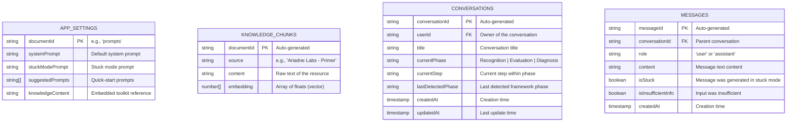
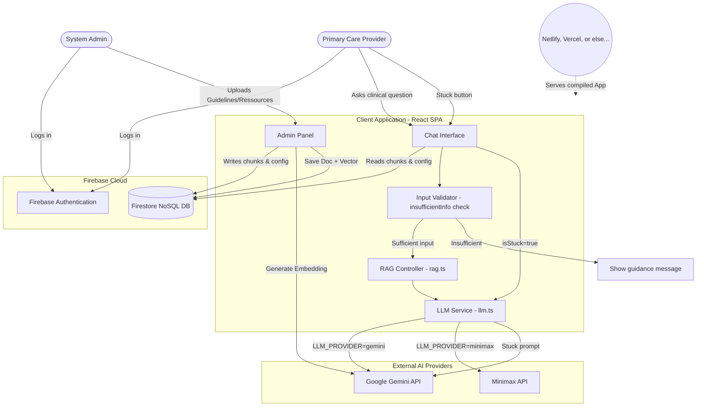
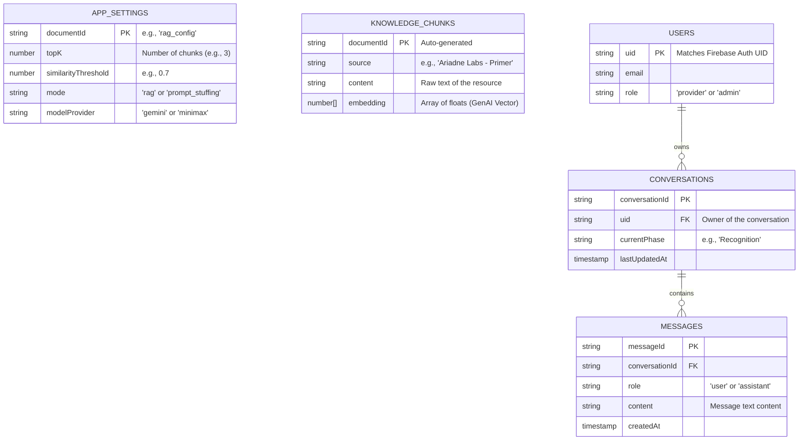

# Dementia Clinical Coach

A clinical decision support web application designed for primary care providers. This tool assists them in the recognition, evaluation, and diagnosis of dementia by leveraging evidence-based medical resources.

## 🌟 Features

- **Specialized AI Coach:** A chatbot powered by Google Gemini API (or MiniMax), configured to provide relevant clinical guidance.
- **Integrated Knowledge Base (RAG):** The assistant uses Retrieval-Augmented Generation (RAG) to ground its responses in the Ariadne Labs "Essential Communications Toolkit".
- **Consultation Management:** Conversation history is saved and organized by session via Firebase.
- **Navigation Map:** An interface guiding the practitioner through 3 key phases: Recognition, Evaluation, and Diagnosis.
- **Stuck Mode:** A special mode for handling relational communication obstacles - skips normal framework structure to address specific stuck points.
- **Input Validation:** Automatic detection of insufficient user input with guidance for better prompts.
- **Admin Panel:** A dedicated interface to inject and manage documentary resources (Knowledge Chunks) and configure RAG parameters.
- **Auto-Seeding:** Automatic injection of default medical resources upon the administrator's first login.
- **Secure Authentication:** Google Sign-In (Firebase Auth) to restrict access.
- **Responsive Design:** Interface optimized for desktop, tablet, and mobile use.

## 🛠️ Tech Stack

- **Frontend:** React 18, TypeScript, Vite
- **Styling:** Tailwind CSS, Lucide React (icons)
- **Backend & Database:** Firebase (Authentication, Firestore)
- **Artificial Intelligence:** Google Gemini API (`@google/genai`) or MiniMax API for text generation and embeddings.

## 🚀 Installation and Setup

### Prerequisites
- Node.js 18+
- A Firebase project with Authentication (Google) and Firestore enabled.
- API keys for Gemini and/or MiniMax (optional - defaults to Gemini)

### Steps

1. **Install dependencies:**
   ```bash
   npm install
   ```

2. **Configuration:**
   
   Create a `.env.local` file with your API keys:
   ```env
   # Gemini API (default LLM)
   GEMINI_API_KEY=your_gemini_api_key
   
   # MiniMax API (alternative LLM - optional)
   MINIMAX_API_KEY=your_minimax_api_key
   MINIMAX_MODEL=MiniMax-M2.7
   MINIMAX_API_BASE_URL=https://api.minimaxi.chat
   MINIMAX_API_PATH=/v1/chat/completions
   
   # LLM Provider selection (default: 'gemini')
   LLM_PROVIDER=gemini  # or 'minimax'
   ```

3. **Firebase Configuration:**
   - Place your `firebase-applet-config.json` at the project root (already included in this project).
   - Deploy Firestore security rules: `firebase deploy --only firestore:rules`

4. **Start the development server:**
   ```bash
   npm run dev
   ```
   The application will be accessible on port 3000.

## 🎯 How It Works

### Normal Mode
The AI provides structured clinical guidance following the framework:
1. **Where you are in the framework** - Recognition, Evaluation, or Diagnosis phase
2. **What needs to happen next** - Immediate next actions
3. **Communication tools you could use** - Ready-to-use phrases from the toolkit
4. **Relational considerations** - Stuck Points framework when relevant

### Stuck Mode
When the "Stuck" button is activated, the AI focuses on relational communication obstacles:
- Skips normal framework structure
- Provides conversational, colleague-like guidance
- Addresses specific stuck points with acknowledge/get curious/summarize-plan approach

### Insufficient Input Handling
The system validates user input before LLM calls:
- Detects vague queries ("help", "patient", "dementia", etc.)
- Provides specific guidance on what information is needed
- Skips LLM call for insufficient inputs, saving API costs

## 🗄️ Database Schema



## 📚 Knowledge Base (RAG)

The application is pre-configured with Ariadne Labs resources:
- **Primer:** Introductory guide to essential communication.
- **Stuck Points Framework:** Framework for managing emotional and relational roadblocks.
- **Phase Guides:** Sample language for Recognition, Evaluation, and Diagnosis phases.

## 🏗️ System Architecture



## 🗄️ Database Schema




## 🔧 Environment Variables

### Frontend (Vite - Client-side)

| Variable | Required | Default | Description |
|----------|----------|---------|-------------|
| `VITE_FIREBASE_API_KEY` | Yes | - | Firebase API key |
| `VITE_FIREBASE_AUTH_DOMAIN` | Yes | - | Firebase auth domain |
| `VITE_FIREBASE_PROJECT_ID` | Yes | - | Firebase project ID |
| `VITE_FIREBASE_APP_ID` | Yes | - | Firebase app ID |
| `GEMINI_API_KEY` | Yes* | - | Google Gemini API key |
| `LLM_PROVIDER` | No | `gemini` | LLM provider: `gemini`, `minimax`, or `harvard` |
| `MINIMAX_API_KEY` | No* | - | MiniMax API key (required if LLM_PROVIDER=minimax) |

### Backend (Netlify Functions - Server-side only)

| Variable | Required | Description |
|----------|----------|-------------|
| `HARVARD_OPENAI_KEY` | If using Harvard | Harvard HUIT API key |
| `HARVARD_OPENAI_BASE_URL` | No | Harvard gateway URL (default: https://go.apis.huit.harvard.edu/ais-openai-direct/v2/) |

*At least one LLM provider API key is required.

## 🚀 Deployment (Netlify)

This application uses Netlify Functions to proxy API calls and avoid CORS issues.

### 1. Set Environment Variables in Netlify Dashboard

Go to **Site Settings → Environment Variables** and add:

For **Harvard Provider:**
- `HARVARD_OPENAI_KEY` = your Harvard API key
- `HARVARD_OPENAI_BASE_URL` = https://go.apis.huit.harvard.edu/ais-openai-direct/v2/

### 2. Deploy

The `netlify.toml` file is pre-configured to:
- Build the React app
- Deploy serverless functions from `netlify/functions/`
- Redirect `/api/*` requests to Netlify Functions

Simply push to your connected Git repository and Netlify will:
1. Run `npm run build`
2. Deploy functions from `netlify/functions/`
3. Serve the app from `dist/`

### 3. Verify Harvard Provider Setup

After deployment, check the **AI Provider** tab in Prompt Settings to confirm:
- Harvard is shown as configured
- When `LLM_PROVIDER=harvard`, responses will be routed through the proxy function

## 🤝 In Collaboration With

This project is done in collaboration with the following schools and labs:

| EPFL | LIGHT LABORATORY | Harvard T.H. Chan School | Ariadne Labs |
| :---: | :---: | :---: | :---: |
|  |  |  |  |


## ⚠️ Security Warning (PHI)

**Warning:** This tool is designed for general clinical decision support. Users **must never** input Protected Health Information (PHI) or identifiable patient data into the chat interface. All queries must be anonymized.